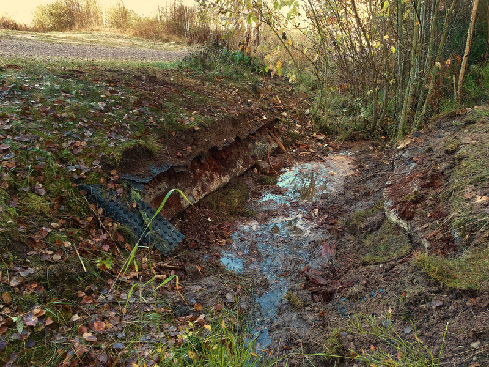
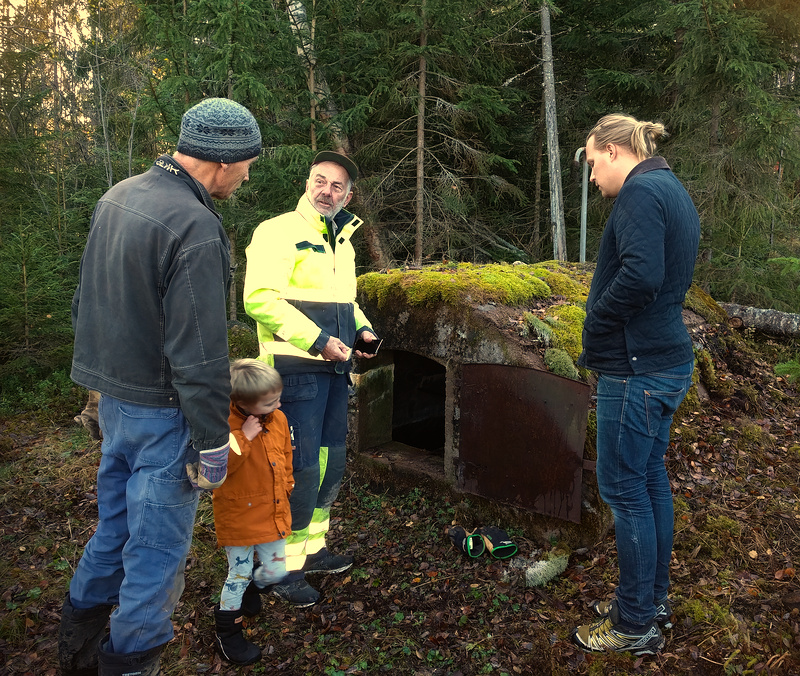

Lördagen den 17 oktober träffades vi vid bystugan och hjälptes åt med lite höstunderhåll. Vi serverade fika förberett med hänsyn till Corona.

Deltagare var
- Ingrid Skogman
- Herman Lindberg
- Perola Nyström
- Dan Jensfelt
- Ann Målare
- Gunilla och Simon Johnston
- Manda Nahlbom och Viktor Tall m.fam.
- Annie och Erik Gammelgård m. barn.
- Jens Målare

Ingrid och Gunilla hjälptes åt att rensa hängrännorna. Det var en kylig morgon och fruset i rännorna men det tinade snart. Ann gjorde köksinventeringen, sorterade och räknade bestick, kunde konstatera att en del verkar saknas. Kalle hade röjt och kvistat björk, och Viktor och Gunilla samlade ihop rishögen som kördes till brasan i Nordåker. Herman, Dan och Simon tog bort den kollapsade bron vid parkeringsplatsen för att göra diket fritt. Vi väntar med att lägga dit trumma och återfylla. Kanske det inte ska vara någon infart där? För gångstigen skulle en enklare spång räcka bra. En patrull rekognoserade vid den av Kalle och Pelle nyligen uppröjda Klockarkällan. Hänglås behövs till luckorna vid båda källorna. Vi ska fråga Gunnar Norén om han kan berätta var "Puststenen" är någonstans och sätter upp skyltarna en annan dag. Annie och Manda förberedde fika och skötte serveringen tillsammans med Ann. Tack alla ni som var med och hjälpte till idag!

Arbeten som finns kvar till en annan dag är:
- Tillverka några fler skyltar
- Sätta upp skyltarna
- Skaffa och sätt dit hänglås på de två källorna
- Förbered på badplatsen inför vintern
- Laga lådan på lekplatsen
- Laga dörren på smedjorna. Erik och Jens m.fl.
- Röj sly och grenar längs stigarna
- Ordna permanent stöd av bjälklaget under bystugan
